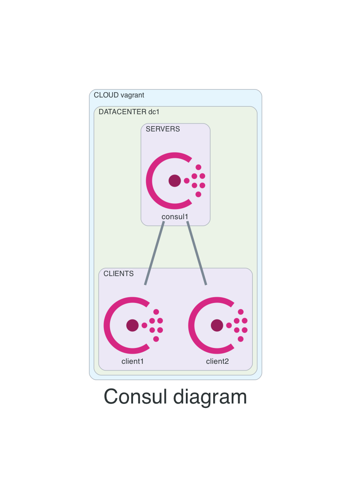

# Gossip encryption
- create one consul server and two consul clients
- encrypt gossip encryption
  - use encrypt="KEY"
  - key is 32bit based64 encoded

## Before creating resources
- from main repo change directory into this example
```
cd 02-consul-gossip-encryption
```

## Diagram


## HTTP Consul:
- http://192.168.56.11:8500

- connect to HTTP endpoint
```
export CONSUL_HTTP_ADDR='http://192.168.56.11:8500'
```

## How to use
- create resources
```
vagrant up
```

- list resources
```
vagrant status
```

- SSH
```
# consul1, client1, client2
vagrant consul1
```

- SSH config for vscode
```
vagrant ssh-config
```

- destroy resources
```
vagrant destroy -f
```

## Consul
- verify consul setup
```
consul info
consul members
consul operator raft list-peers
```
