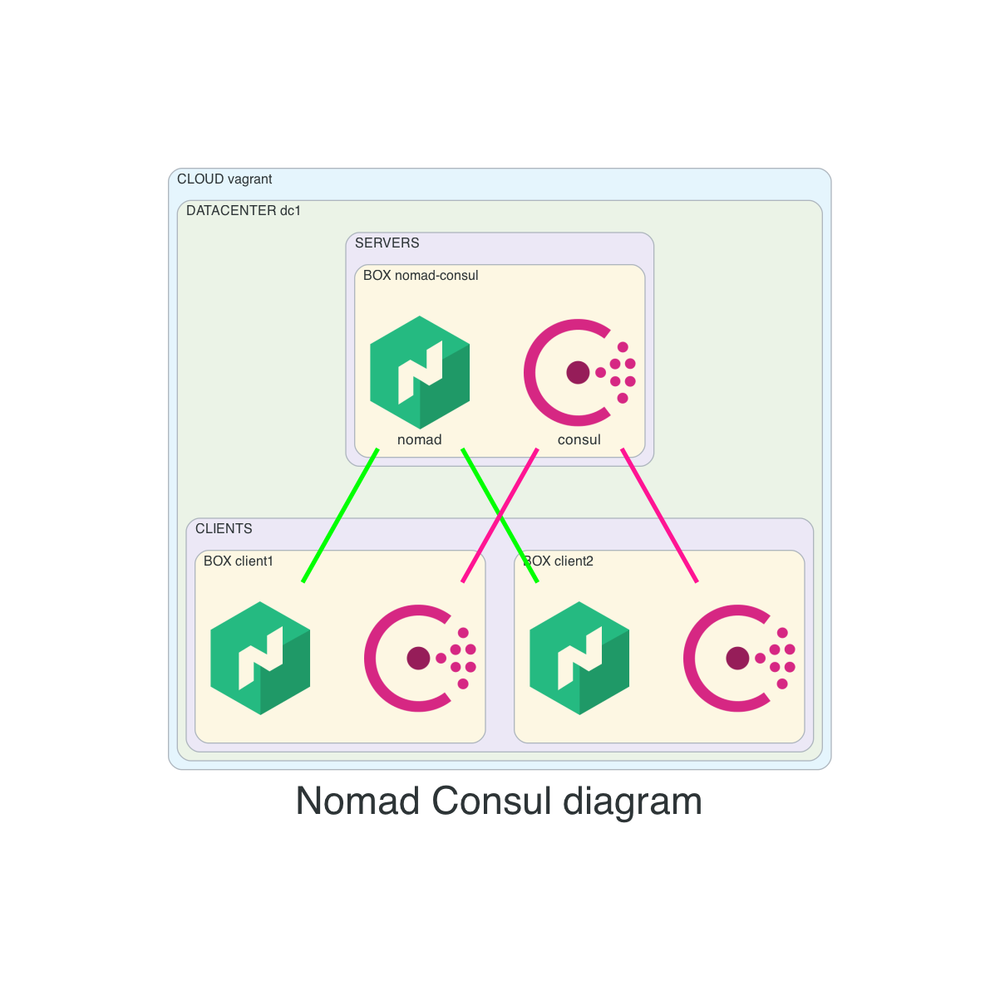

# nomad-consul
- create 3 boxes:
  - box: `nomad-consul`
    - consul running in server mode
    - nomad running in server mode
  - box: client1 & cilent2
    - consul client
    - nomad client/worker
    - CNI installed
    - docker installed

## Before creating resources
- from main repo change directory into this example
```
cd 03-nomad-consul
```

## Diagram


- HTTP Endpoint
```
export CONSUL_HTTP_ADDR='http://192.168.56.11:8500'
export NOMAD_ADDR='http://192.168.56.11:4646'
```

## How to use
- create resources
```
vagrant up
```

- list resources
```
vagrant status
```

- SSH
```
# consul1, client1, client2
vagrant consul1
```

- SSH config for vscode
```
vagrant ssh-config
```

- destroy resources
```
vagrant destroy -f
```

## Consul
- verify consul setup
```
consul info
consul members
consul operator raft list-peers
```

## Nomad
- verify nomad setup
```
nomad server members
nomad node status
nomad operator raft list-peers
```
