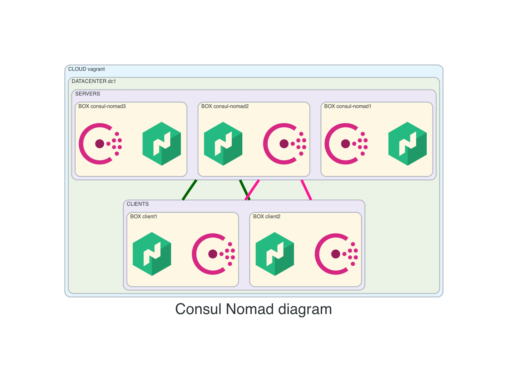

# nomad-consul
- create 5 boxes:
  - 3X `consul-nomad`
    - consul running in server mode
    - nomad running in server mode
  - 2X `client`
    - consul client
    - nomad client/worker
    - CNI installed
    - docker installed

## Before creating resources
- from main repo change directory into this example
```
cd 04-3consul-nomad-2clients
```

## Diagram


## Connect
- API
```
export CONSUL_HTTP_ADDR='http://192.168.56.11:8500'
export NOMAD_ADDR='http://192.168.56.11:4646'
```

- HTTP
  - Nomad: http://192.168.56.11:8500
  - Consul: http://192.168.56.11:4646

- IPs
 - SERVERS: 192.168.56.11, 192.168.56.12, 192.168.56.13
 - CLIENTS: 192.168.56.51, 192.168.56.52

## How to use
- create resources
```
vagrant up
```

- list resources
```
vagrant status
```

- SSH
```
vagrant ssh <VM-NAME>
```

- SSH config for vscode
```
vagrant ssh-config <VM-NAME>
```

- destroy resources
```
vagrant destroy -f
```

## Consul
- verify consul setup
```
consul info
consul members
consul operator raft list-peers
```

## Nomad
- verify nomad setup
```
nomad server members
nomad node status
nomad operator raft list-peers
```
