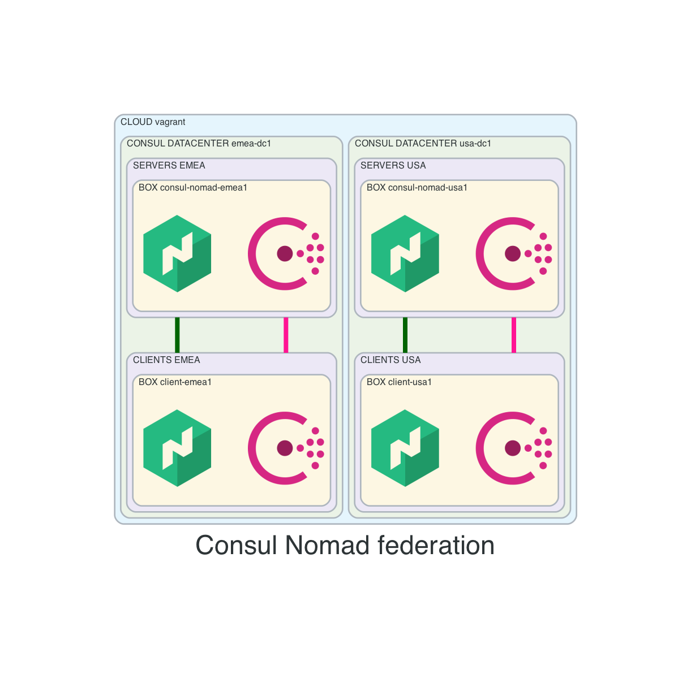

# consul-nomad-federation
This vagrant setup will create
- 2 consul datacenters
  - emea-dc1
  - usa-dc1
- 2 nomad regions:
  - emea
    - datacenter: emea-dc1
  - usa
    - datacenter: usa-dc1

## Before creating resources
- from main repo change directory into this example
```
cd 05-consul-nomad-federation
```

- create license files
```
touch ./licenses/consul.hclic
touch ./licenses/nomad.hclic
```

- add licenses
```
echo "CONSUL-LICENSE >" > ./licenses/consul.hclic
echo "NOMAD-LICENSE" > ./licenses/nomad.hclic
```

## Diagram


## Connect
- API
```
# EMEA
export CONSUL_HTTP_ADDR='http://192.168.56.11:8500'
export NOMAD_ADDR='http://192.168.56.11:4646'

# USA
export CONSUL_HTTP_ADDR='http://192.168.56.101:8500'
export NOMAD_ADDR='http://192.168.56.101:4646'
```

- HTTP
  - EMEA
    - Nomad: http://192.168.56.11:8500
    - Consul: http://192.168.56.11:4646
  - USA
    - Nomad: http://192.168.56.101:8500
    - Consul: http://192.168.56.101:4646

- IPs
  - EMEA
    - SERVERS: 192.168.56.11
    - CLIENTS: 192.168.56.51
  - USA
    - SERVERS: 192.168.56.101
    - CLIENTS: 192.168.56.151

## How to use
- create resources
```
vagrant up
```

- list resources
```
vagrant status
```

- SSH
```
vagrant ssh <VM-NAME>
```

- SSH config for vscode
```
vagrant ssh-config <VM-NAME>
```

- destroy resources
```
vagrant destroy -f
```

## Consul
- verify consul setup
```
consul info
consul members
consul members -wan
consul operator raft list-peers
```

## Nomad
- verify nomad setup
```
nomad server members
nomad node status
nomad operator raft list-peers
```
