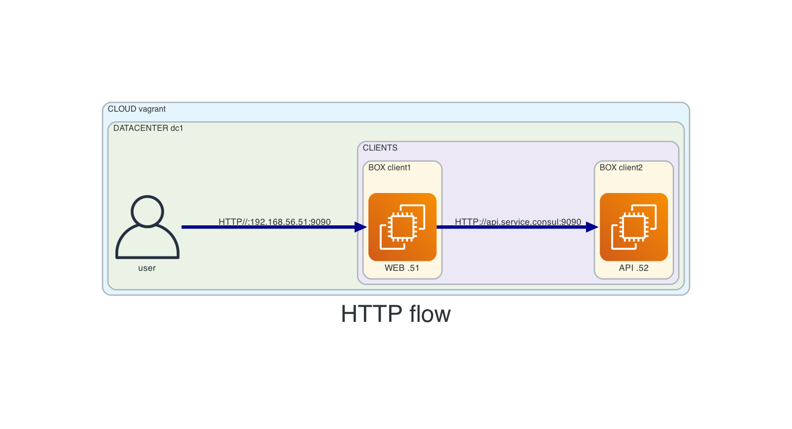

# 06-1consul-2clients-service-discovery
This vagrant setup will create
- 2 services:
  - web (client1)
    - requests served by fake-service
    - service registered in consul
    - web service makes further requests against api
  - api (client2)
    - requests served by fake-service
    - service registered in consul
- 3 VMs:
  - consul1 (server)
  - client1 (web service)
  - client2 (api service)

## Before creating resources
- from main repo change directory into this example
```
cd 06-1consul-2clients-service-discovery
```

## Diagram



## Connect
- APP access: http://192.168.56.51:9090

- Consul API
```
export CONSUL_HTTP_ADDR='http://192.168.56.11:8500'
```


## How to use
- create resources
```
vagrant up
```

- list resources
```
vagrant status
```

- SSH
```
vagrant ssh <VM-NAME>
```

- SSH config for vscode
```
vagrant ssh-config <VM-NAME>
```

- destroy resources
```
vagrant destroy -f
```

## Consul
- verify consul setup
```
consul info
consul members
consul operator raft list-peers
```