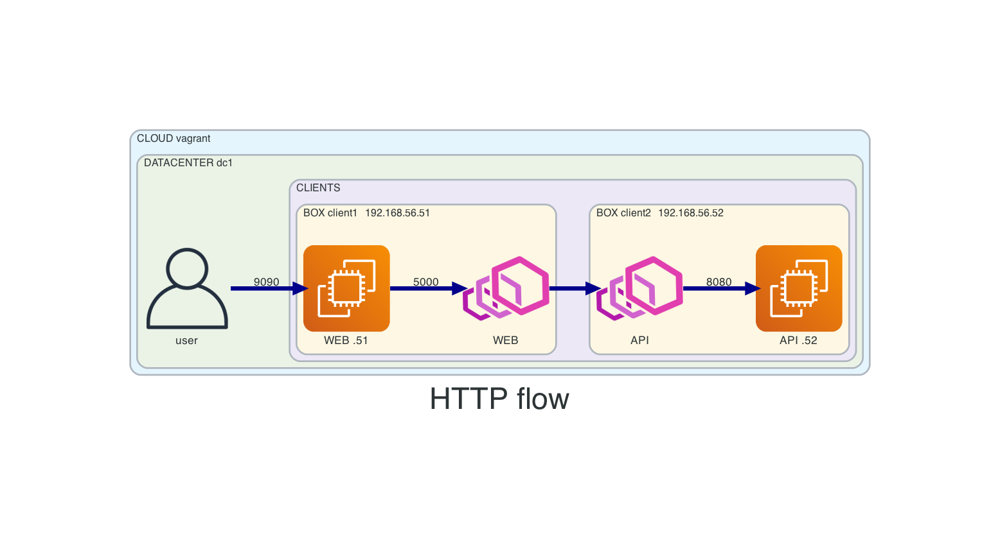

# 07-1consul-2clients-mesh
This vagrant setup will create
- 2 services and 2 envoy-proxies:
  - web (client1)
    - service registered in consul
    - http requests served by fake-service
    - web service (fake-service bin) makes further requests through envoy-proxy to api
  - api (client2)
    - requests are received by envoy-proxy
    - envoy-proxy requests sent to api (fake-service binary)
    - service registered in consul
- 3 VMs:
  - consul1 (server)
  - client1 (web service)
  - client2 (api service)

## Before creating resources
- from main repo change directory into this example
```
cd 07-1consul-2clients-mesh
```

## Diagram



## Connect
- APP access: http://192.168.56.51:9090

- Consul API
  - consul1:
  ```
  export CONSUL_HTTP_ADDR='http://192.168.56.11:8500'
  ```

  - client1:
  ```
  export CONSUL_HTTP_ADDR='http://192.168.56.51:8500'
  ```

  - client1:
  ```
  export CONSUL_HTTP_ADDR='http://192.168.56.52:8500'
  ```

## How to use
- create resources
```
vagrant up
```

- list resources
```
vagrant status
```

- SSH
```
vagrant ssh <VM-NAME>
```

- SSH config for vscode
```
vagrant ssh-config <VM-NAME>
```

- destroy resources
```
vagrant destroy -f
```

## Consul
- verify consul setup
```
consul info
consul members
consul operator raft list-peers
```