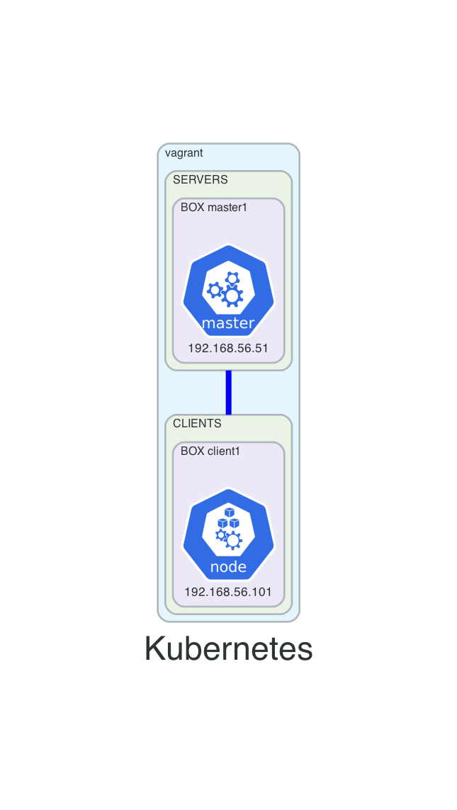

# 08-k8-1master-1node
This vagrant setup will create a kubernetes cluster:
- 2 VMs:
  - master1
    - pods created using kubeadm
  - client1

## Before creating resources
- from main repo change directory into this example
```
cd 08-k8-1master-1node
```

## Diagram



## How to use
- create resources
```
vagrant up
```

- list resources
```
vagrant status
```

- SSH
```
vagrant ssh <VM-NAME>
```

- destroy resources
```
vagrant destroy -f
```

## Kubernetes
- verify setup from `master1`
```
kubectl get nodes -o wide
kubectl get pods -n kube-system
```
- run nginx
```
kubectl run nginx --image=nginx
kubectl get pods -o wide
```