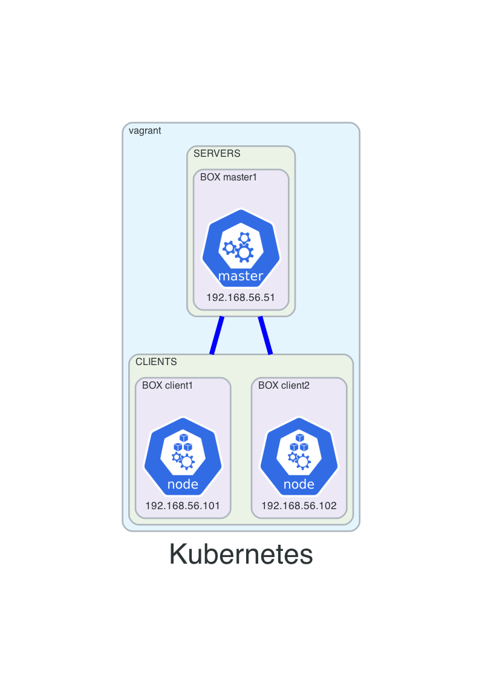

# 08-k8-1master-1node
This vagrant setup will create a kubernetes with consul on it:
- 3 VMs:
  - master1
   - kubernetes control plane
   - pods created using kubeadm
  - client1 and client2
    - kubernetes workers
- consul being deployed using helm

## TODO
[] install k8 storage driver that is needed by consul


## Before creating resources
- from main repo change directory into this example
```
cd 08-k8-1master-1node
```

## Diagram



## How to use
- create resources
```
vagrant up
```

- list resources
```
vagrant status
```

- SSH
```
vagrant ssh <VM-NAME>
```

- destroy resources
```
vagrant destroy -f
```

