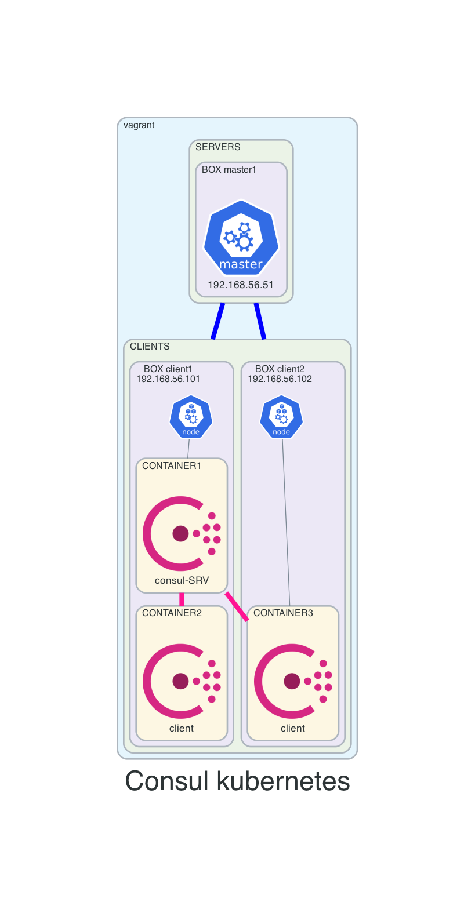

# 09-k8-consul
This vagrant setup will create a kubernetes with consul on it:
- 3 VMs:
  - master1
   - kubernetes control plane
   - pods created using kubeadm
  - client1 and client2
    - kubernetes workers
- consul being deployed using consul-k8
- PersistentVolume is local, not perfect but works


## Before continuing
- from main repo change directory into this example
```
cd 09-k8-consul
```

## Diagram


## How to use
- create resources
```
vagrant up
```

- list resources
```
vagrant status
```

- SSH
```
vagrant ssh <VM-NAME>
```

- destroy (after lab finished)
```
vagrant destroy -f
```

## Deploy consul
- login on master1
```
vagrant ssh master1
```

- change directory
```
cd /vagrant/examples
```

- create PersistentVolume (local-storage)
```
kubectl apply -f pv-consul.yaml
```

- consul-k8 deploy
```
consul-k8s install -config-file values.yaml
```

- list pods
```
kubectl -n consul get pods -o wide
```

- login server container
```
kubectl -n consul exec -it consul-server-0
```

- verify consul setup
```
consul info
consul members
consul operator raft list-peers
```