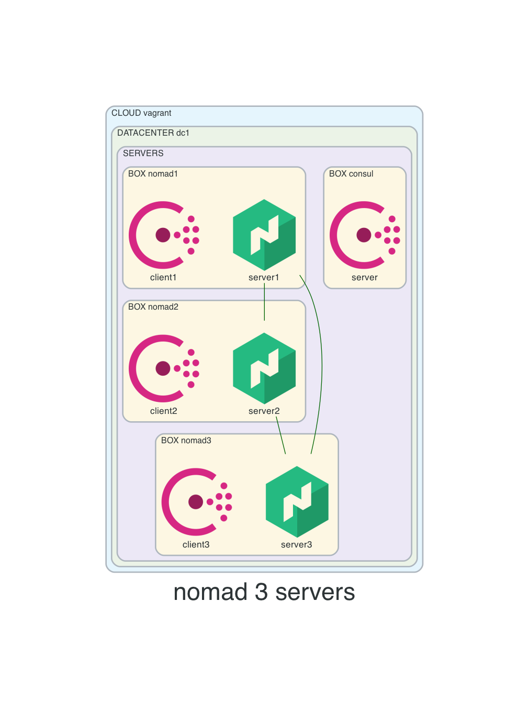
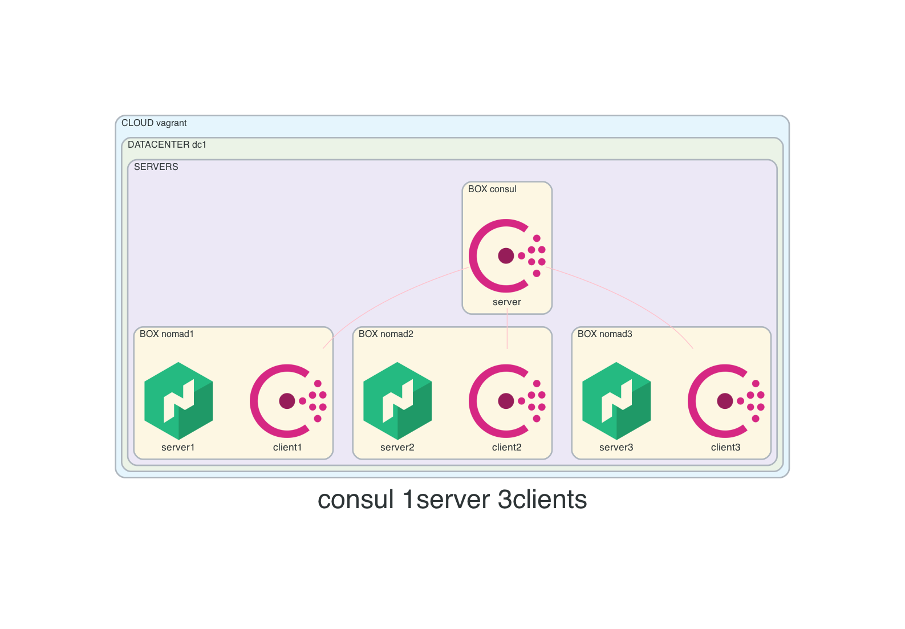

# 10-nomad-agent-snapshot
This repo will build 3 nomad servers that have also consul snapshot agents running on them, taking snapshots from leader.
Nomad snapshot agents will communicate with consul to build a KV store entry to keep track of which machine contains the nomad leader.  
Keeping track of who is the leader is important because Leader has the most accurate data when snapshot is taken.  
Check [Consul Dynamic App Configuration](https://www.consul.io/docs/dynamic-app-config/sessions#session-design) and [app-leader-election-with-sessions](https://learn.hashicorp.com/tutorials/consul/application-leader-elections).

* Diagrams included bellow

## How to use this repo
- create resources
```console
vagrant up
```

- list resources
```console
vagrant status
```

- SSH
```console
# nomad1, nomad2, nomad3, consul1
vagrant ssh nomad1
```

- destroy resources
```console
vagrant destroy -f
```

## Diagrams



## Nomad
- nomad members
```console
nomad members
```

- nomad leader
```console
nomad operator raft list-peers
```

- snapshot agent
```console
systemctl status nomad-snapshot.service
```

## Consul
- members
```console
consul members
```

- consul leader
```console
consul operator raft list-peers
```

- consul kv store (path based on agent snapshot config)
```console
consul kv get -keys nomad-snapshot/lock
```

- troubleshoot API calls made by consul clients
```console
consul monitor --log-level=DEBUG
```