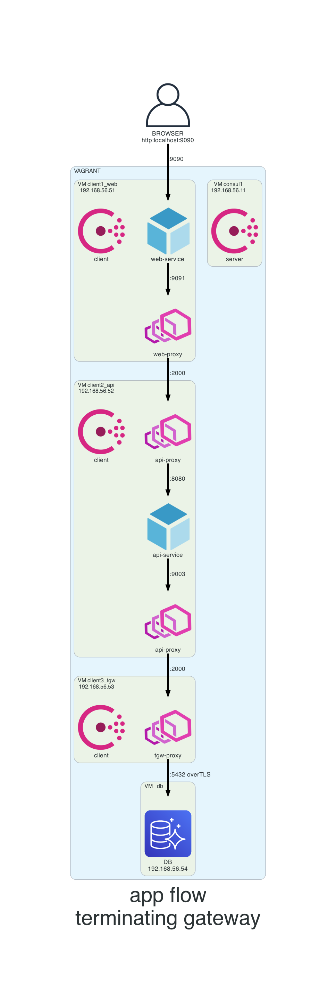
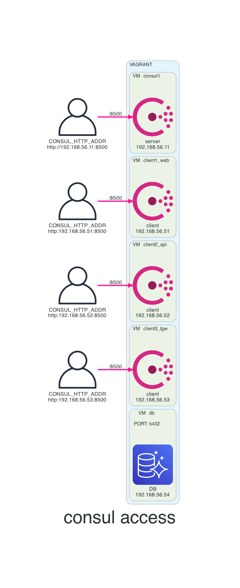
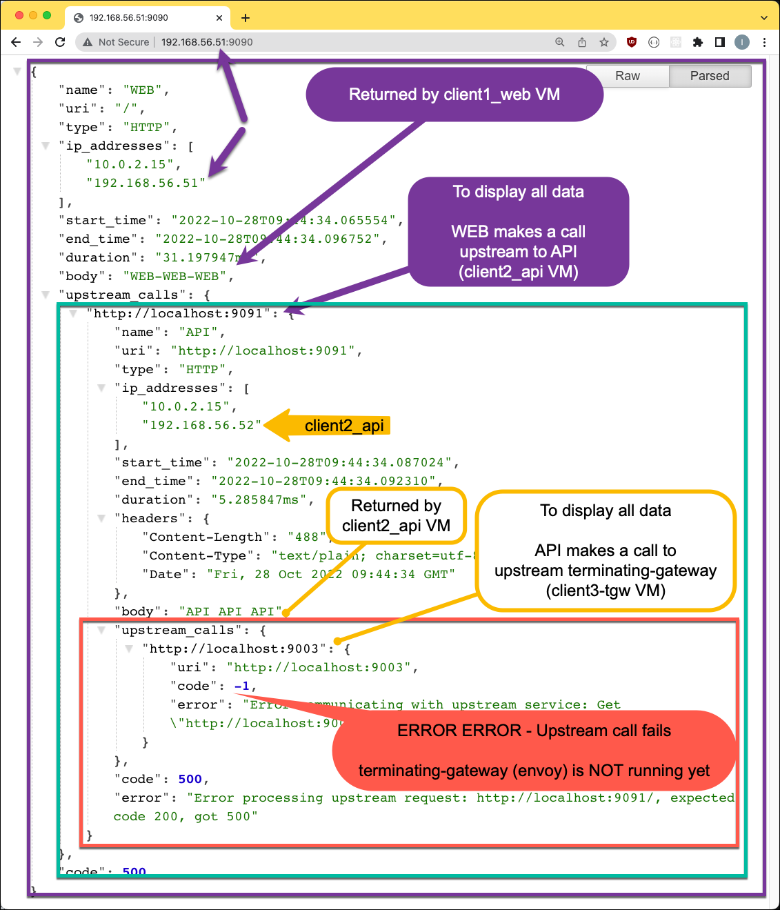
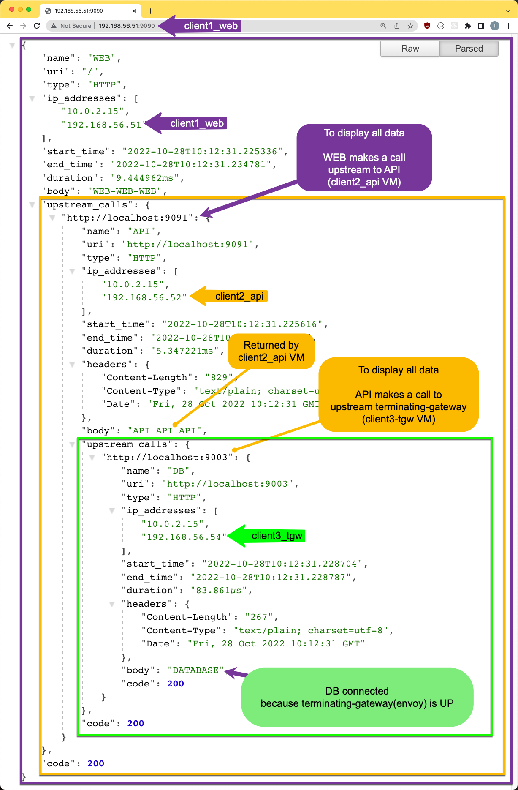

# 11-csul-nmd-term-gateway-tls
What this LAB will do:
- build 5 VMs with Vagrant:
    - __`consul`__ - consul server
    - __`client1_web`__ - web is a frontend application that can be reached by browser
    - __`client2_api`__ - api is a backend application
    - __`client3_tgw`__ - terminating gateway that bridges API with the database
    - __`client4_db`__ - legacy database (fake database, just a TCP listener)
- build an app on service mesh & an old database outside mesh:
    - chrome browser accesses application called __`web`__ residing in the mesh
    - __`web`__ app is accessing the __`api`__ app through service mesh
    - __`api`__ app accesses the database __`db`__ outside mesh via a terminating gateway
    - terminating gateway (__`client3-tgw`__) will bridge __`api`__ and __`database`__
        - will allow mesh to connect outside mesh (not the other way around)
        - tgw connects to DB via TLS (secure)
    - communication between envoy sidecars are always on port __`:2000`__

# Diagrams
In the diagram bellow:
-  VM `client2_api` has on diagram two __`api-proxy`__ illustrated but in fact its one envoy instance running



## How to use this LAB
- cd into this lab
```console
cd 11-csul-nmd-term-gateway-tls
```

- RUN the LAB
```console
vagrant up
```

- consul UI: 
    - [http://192.168.56.11:8511](http://192.168.56.11:8511)

- application access: 
    - [http://192.168.56.51:9090/](http://localhost:9090/)
    - [http://192.168.56.51:9090/ui](http://localhost:9090/ui)

- check consul members
```console
CONSUL_HTTP_ADDR=http://192.168.56.51:8511 \
    consul members
```


## Register external service on non-existing (virtual) consul node
- the __`database`__ (db VM) is the virtual consul node
- why you cannot register a service or node from CLI via consul agent binary?
    - if you register a service via the CLI, it will be associated directly with the agent with which you are communicating

- external services must be associated with non-existing (external) nodes

- register an __`external node`__ via __`/catalog/register`__
```console
curl --request PUT --data @./config/external-node-register.json http://192.168.56.11:8500/v1/catalog/register
```
```json
{
  "Node": "external_database_virtual_consul_node",
  "Address": "192.168.56.54",
  "NodeMeta": {
    "external-node": "true",
    "external-probe": "true"
  }
} 
```

- register a __`external service`__ with the existing __`external node`__ via __`/catalog/register`__
```console
curl --request PUT --data @./config/service-external-database.json http://192.168.56.11:8500/v1/catalog/register
```
```json
{
    "Node": "external_database_virtual_consul_node",
    "Address": "192.168.56.54",
    "Service": {
        "ID": "external_database",
        "Service": "external_database",
        "Port": 5432
    }
}
```

- configure terminating gateway with a `config entry`
    - link external service to external node
```console
CONSUL_HTTP_ADDR=http://192.168.56.11:8500 \
    consul config write config/terminating-gateway.hcl
```
```hcl
Kind = "terminating-gateway"
Name = "external_database_virtual_consul_node"

Services = [
 {
   Name     = "external_database"
   CAFile   = "/vagrant/certificates/ca.pem"
   CertFile = "/vagrant/certificates/client.pem"
   KeyFile  = "/vagrant/certificates/client-key.pem"
   SNI      = "db-client"
 }
]
```

- optional, verify certificates fields (SAN)
```console
openssl x509 -noout -text -in certificates/client.pem
```
```console
openssl x509 -noout -text -in certificates/server.pem
```

## Application up to this point
- there is no connectivity between API and the database (TGW/envoy not started)
- open browser on your laptop
    - [http://192.168.56.51:9090/](http://192.168.56.51:9090/)
        - displays json received
        

## RUN run terminating gateway
- start __`tgw-proxy.service`__ on client3_tgw VM
```console
vagrant ssh client3_tgw
```

```console
sudo systemctl start tgw-proxy.service
```

## Application up and running
- terminating-gateway is started (envoy via tgw-proxy service)
- open browser on your laptop
    - [http://192.168.56.51:9090/ui](http://192.168.56.51:9090/ui)
    - [http://192.168.56.51:9090/](http://192.168.56.51:9090/)
        - displays json received
        

# Destroy LAB
- bring down VMs
```console
vagrant destroy
```