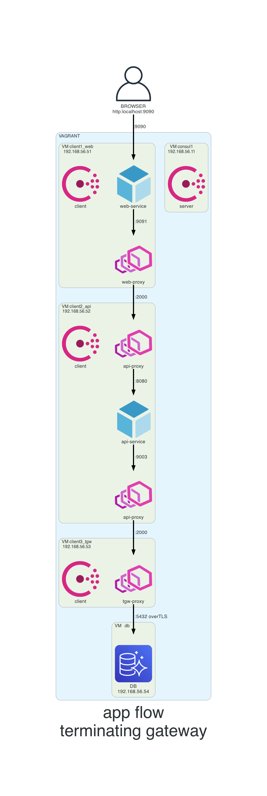

# Diagrams

## Generate a diagram
- install python diagrams, [instructions](https://diagrams.mingrammer.com/docs/getting-started/installation)
- generate a diagram example
```
python3 diagram.py
```

## Attached diagrams

